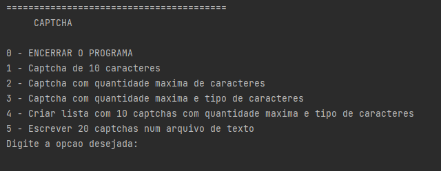

# Gerador de captcha feito em Python

Código desenvolvido para gerar captchas automaticamente ao usuário.

    

## Autor
Feito por [@fernandogong](https://github.com/fernandogong).

LinkedIn: [Fernando Gong](https://www.linkedin.com/in/fernando-gong/)  
Email: [fernand0cg0ng@gmail.com](mailto:fernand0cg0ng@gmail.com)
